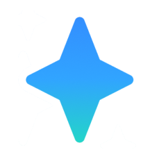
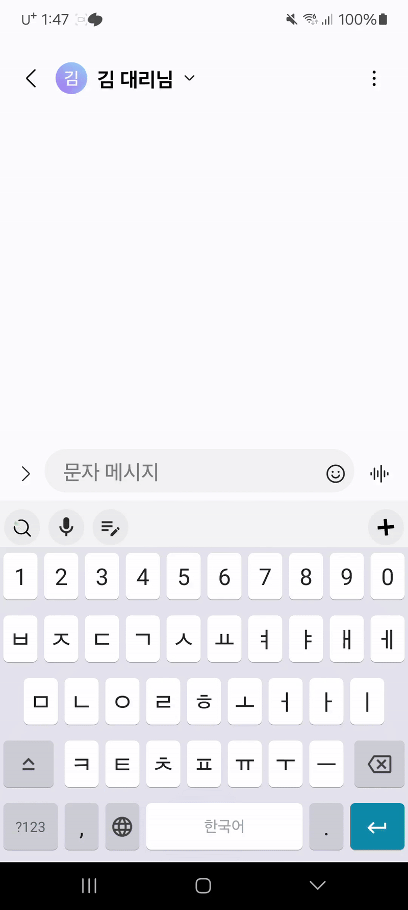
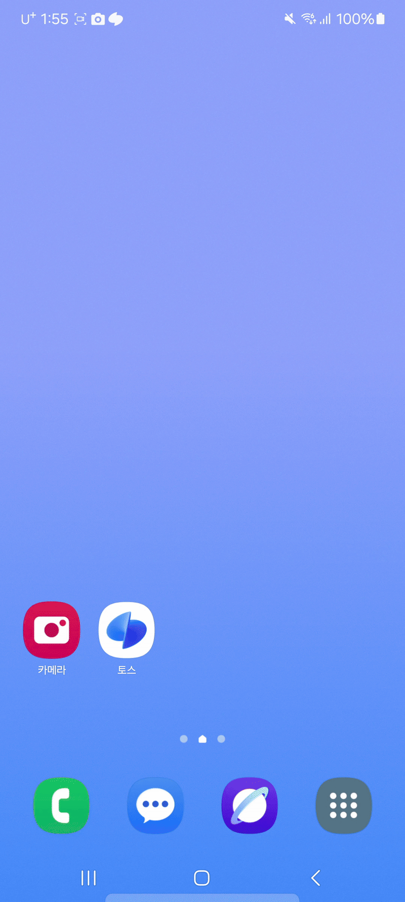
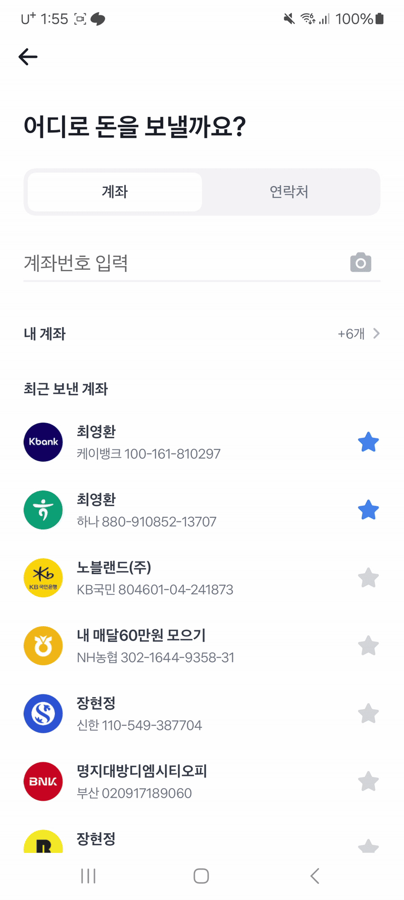

<p align="left" style="display: flex; align-items: center;">
  <h1 style="font-size: 2em; font-weight: bold;">Galaxy Keyboard Plus </h1>
</p>

**경계를 뛰어넘는 확장성, 어디서나 만나는 스마트 AI 키보드**
  
<br />


## 🥇 삼성 청년 SW AI 아카데미 12기 자율 프로젝트 수상 🥇
### 본선 부울경 1등
### 전국 결선 4등

<Br />


---
## 1. 서비스 소개

- Galaxy Keyboard Plus는 스마트폰 키보드에서 앱 전환 없이 필요한 정보를 **바로** 검색·입력할 수 있는 AI 기반 키보드입니다.
- 사진 검색(RAG), 정보 자동 입력, 서비스 확장(MCP) 기능을 통해 입력 도구를 스마트하게 혁신합니다.
- 이미지 캡셔닝 + RAG, Google Vision API, LangChain 기반 MCP 연동 등의 최신 기술을 통합하여 구현했습니다.

<br />
<br />
<br />

## 2. 팀원 소개
> Galaxy Keyboard Plus는 6인의 팀원이 기획, 개발, 발표까지 전 과정을 함께 주도한 협업 프로젝트입니다.  
> 주요 담당 역할은 중심 기여 영역을 기준으로 나열하되, **모든 팀원이 서로의 작업에 적극 참여**하며 함께 완성도를 높였습니다.

| 이름     | 역할 / 중심 담당                           |
|----------|---------------------------------------------|
| 김다정 | 팀장 / AI 검색 모델(RAG) 설계 및 구현 , QnA 대비       |
| 이조은 | 발표자, 웹 개발, 발표 자료 제작          |
| 이진호 | CICD 환경 구축, MCP 구조 설계         |
| 장현정 | 오퍼레이터, Android 키보드 구현, 영상 제작 |
| 최영환 | 휴대폰 시연자, Android 키보드 구현    |
| 한송헌 | 발표 시연자, MCP 기능 구현         |

> 🔄 기획부터 개발, 발표까지 전원이 적극 참여하며 기능별/시기별로 역할을 유연하게 나누고 협업했습니다.


<br />
<br />
<br />


## 3. 기술 스택

### 3-1. Frontend


### 3-2. Backend


### 3-3. AI / 검색


### 3-4. DB / Storage


### 3-5. DevOps & Infra


<br />
<br />
<br />


## 4. 주요 기능 및 이미지

### 📸 스마트 사진 검색  
> 어떤 앱에서든, 어느 내용이든 원하는 사진을 찾아주는 스마트 사진 검색
<h4>→ 이미지 캡셔닝 + RAG</h4>
<h4>기능 이용 3단계</h4>

1. 검색할 사진에 대한 내용을 **아무 입력창에 입력**
2. 키보드 속 **스마트 검색 버튼** 터치
3. 결과 사진을 **드래그 앤 드롭**하여 전송

{width=280}
{width=280}
{width=280}


<br />
<br />
<br />
<br />
<br />

---

### ✨ AI 스마트 클립 (정보 자동 입력)  
> 사진 촬영 한 번이면, 계좌번호, 와이파이 비밀번호 등 복잡한 정보를 자동 인식 및 붙여넣기
<h4>→ Google Cloud Vision OCR + AI 기반 텍스트 분석</h4>

<h4>기능 이용 3단계</h4>

1. 인식하고 싶은 정보를 **촬영**
2. 입력할 앱으로 **이동**
3. 입력창에서 키보드 속 **AI 스마트 클립 버튼 터치**

{width=280}
{width=280}
{width=280}


<br />
<br />
<br />
<br />
<br />

---

### ➕ 플러스 버튼 (서비스 확장)  
> 사용자의 입력 의도에 따라 AI 키보드가 스스로 판단하고, 필요한 도구(MCP)를 자동으로 연결합니다.  
<h4>→ LangChain 기반 MCP 연동</h4>

<h4>기능 이용 3단계</h4>


1. 평소 사용하던대로 **키보드 이용** (자동 인식)
2. 플러스 버튼이 **필요한 기능의 모습으로 바뀌면 터치**
3. 실행부터 **결과까지 키보드에서 확인**

{width=280}
{width=280}
{width=280}

<br />


<br />
<br />
<br />


## 5. 시스템 아키텍처


- Gateway, AI 검색 서버, Auth 서버 등으로 구성된 마이크로서비스 구조
- AI 처리와 일반 API 요청을 분리하여 확장성과 응답속도 향상

<br />
<br />
<br />
<br />


## 6. 발표 자료
> 최신순으로 정렬하여, 결선 발표 자료가 최종 자료입니다
- 🔥 [전국 결선 발표 자료](https://docs.google.com/presentation/d/1xJ4CwHEG2HrKF_ReNNDggrFLE5yuTHZs/edit?usp=sharing&ouid=101406336604846630208&rtpof=true&sd=true)
- 🍧 [부울경 본선 발표 자료](https://docs.google.com/presentation/d/1OH80iTiKdadgmwIgSFDw1ve8DLxHaxuR/edit?usp=sharing&ouid=101406336604846630208&rtpof=true&sd=true)
- 💡 [부울경 반 내 최종 발표 자료](https://docs.google.com/presentation/d/1oqV3E1BOy_GyMjVWkDWOpHKxs0L2TLIx/edit?usp=sharing&ouid=101406336604846630208&rtpof=true&sd=true)


<br />
<br />
<br />


## 7. 영상 포트폴리오
> 최신순으로 정렬하여, 결선 소개 영상이 최종 자료입니다
- 📽 [Galaxy Keyboard Plus **결선** 소개 영상 (결선)](https://drive.google.com/file/d/1ooJtfFJh7qr1CLWakcKC93oAko80wdm8/view?usp=sharing) 
- 📽 [Galaxy Keyboard Plus **본선** 소개 영상 (본선](https://drive.google.com/file/d/10h5zwvdSDmdZOyceY-5zarK89NX7usJl/view?usp=sharing) 


<br />
<br />
<br />


## 8. 문서 자료

- 🔗 [포팅 메뉴얼](exec/E201_그로밋_자율프로젝트_포팅메뉴얼.pdf)
- 📄 [시연 시나리오](exec)

<br />
<br />
<br />


## 9. 배포 특이사항

- 


<br />
<br />
<br />


## 10. 팀 프로젝트 과정
> 사진 추가 예정


<br />
<br />
<br />


---

> © 2025 Galaxy Keyboard Plus Team 


<br />
<br />
<br />
<br />
<br />
<br />
<br />
<br />
<br />
<br />

--- 
### 아래는 프로젝트를 진행하며 지킨 컨벤션 관련된 정보가 적혀있습니다

# 📘 Git 컨벤션 안내

## 📌 브랜치 네이밍 규칙

| 유형     | 접두어 예시            | 설명                            |
|----------|-------------------------|---------------------------------|
| 기능 추가 | `feature/`             | 새로운 기능 개발 시 사용         |
| 버그 수정 | `fix/`                 | 버그 수정 시 사용                |
| 문서 작업 | `docs/`                | 문서 관련 작업 시 사용           |
| 리팩토링 | `refactor/`             | 코드 리팩토링 (기능 변경 없음)  |
| 테스트   | `test/`                | 테스트 코드 추가 및 수정         |
| 배포     | `release/`             | 배포 관련 작업                  |
| 설정 변경 | `chore/`              | 설정 파일 변경 등 기타 작업      |

> ✅ 예시  
> `feature/login-api`  
> `fix/null-pointer-login`  
> `refactor/user-service`  

---

## 📌 커밋 메시지 규칙

커밋 메시지는 다음과 같은 형식을 따릅니다:
```
<타입>: <간결한 설명>
```

### ✅ 타입 목록

| 타입       | 설명                                       |
|------------|--------------------------------------------|
| `feat`     | 새로운 기능 추가                            |
| `fix`      | 버그 수정                                  |
| `docs`     | 문서 추가 또는 수정                         |
| `style`    | 코드 스타일 변경 (포맷, 세미콜론 등)        |
| `refactor` | 리팩토링 (기능 변화 없이 코드 개선)         |
| `test`     | 테스트 코드 추가 또는 수정                  |
| `chore`    | 빌드 설정, 패키지 매니저 설정 등 기타 변경 |
| `hotfix`   | 급한 수정 사항 반영 시 사용                  |

---

## ✅ 기타 규칙

- 커밋 메시지는 명확하고 간결하게 작성합니다.
- 하나의 커밋에는 하나의 변경 목적만 포함되도록 합니다.
- PR(Pull Request) 제목도 커밋 메시지 규칙을 따릅니다.

---

## 📌 TIL 브랜치 및 MR 규칙

### 🔧 TIL 브랜치 네이밍 규칙

- **형식**: `til/[본인이름]/YYYY-MM-DD`
- **예시**: `til/dj/2024-04-14`

> 날짜별 브랜치로 구분하여 하루 단위로 학습 내용을 관리합니다.

### ✅ TIL 커밋 메시지 예시
```
docs: 2024-04-14 TIL 작성
```
---
### 🔁 Merge Request (MR) 규칙

- **MR 제목**: 커밋 메시지와 동일하게 작성  
  예: `docs: 2024-04-14 TIL 작성`

- **MR 설명**: 해당 날짜에 학습한 주요 내용 간략 정리  
```
ex: 
- Git 커밋 컨벤션에 대한 학습 내용 정리
- LangChain Prompt 구성과 LLM 응답 포맷팅
- CSP 관련 디버깅 경험 추가
```
---
## 🧩 TIL 작업 절차 요약

1. 브랜치 생성  
 ```
 git checkout -b til/2024-04-14
```
2. TIL 작성 후 커밋
```
git add .
git commit -m "docs: 2024-04-14 TIL 작성"
```
3. 원격 브랜치 푸시
```
git push origin til/2024-04-14
```
4. GitLab에서 MR 생성 → 제목 및 설명 작성 → 리뷰 요청
5. 리뷰 후 머지
---