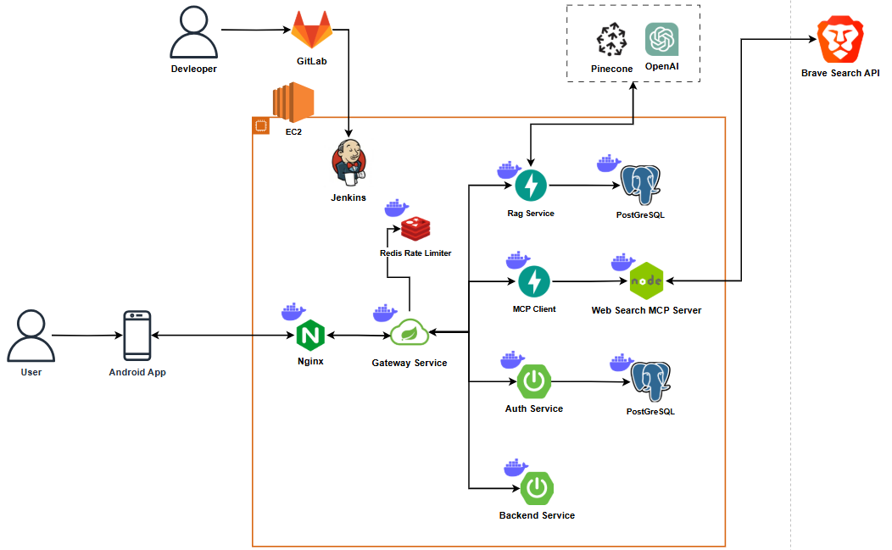

## 📐 시스템 아키텍처




# 📘 Git 컨벤션 안내

## 📌 브랜치 네이밍 규칙

| 유형     | 접두어 예시            | 설명                            |
|----------|-------------------------|---------------------------------|
| 기능 추가 | `feature/`             | 새로운 기능 개발 시 사용         |
| 버그 수정 | `fix/`                 | 버그 수정 시 사용                |
| 문서 작업 | `docs/`                | 문서 관련 작업 시 사용           |
| 리팩토링 | `refactor/`             | 코드 리팩토링 (기능 변경 없음)  |
| 테스트   | `test/`                | 테스트 코드 추가 및 수정         |
| 배포     | `release/`             | 배포 관련 작업                  |
| 설정 변경 | `chore/`              | 설정 파일 변경 등 기타 작업      |

> ✅ 예시  
> `feature/login-api`  
> `fix/null-pointer-login`  
> `refactor/user-service`  

---

## 📌 커밋 메시지 규칙

커밋 메시지는 다음과 같은 형식을 따릅니다:
```
<타입>: <간결한 설명>
```

### ✅ 타입 목록

| 타입       | 설명                                       |
|------------|--------------------------------------------|
| `feat`     | 새로운 기능 추가                            |
| `fix`      | 버그 수정                                  |
| `docs`     | 문서 추가 또는 수정                         |
| `style`    | 코드 스타일 변경 (포맷, 세미콜론 등)        |
| `refactor` | 리팩토링 (기능 변화 없이 코드 개선)         |
| `test`     | 테스트 코드 추가 또는 수정                  |
| `chore`    | 빌드 설정, 패키지 매니저 설정 등 기타 변경 |
| `hotfix`   | 급한 수정 사항 반영 시 사용                  |

---

## ✅ 기타 규칙

- 커밋 메시지는 명확하고 간결하게 작성합니다.
- 하나의 커밋에는 하나의 변경 목적만 포함되도록 합니다.
- PR(Pull Request) 제목도 커밋 메시지 규칙을 따릅니다.

---

## 📌 TIL 브랜치 및 MR 규칙

### 🔧 TIL 브랜치 네이밍 규칙

- **형식**: `til/[본인이름]/YYYY-MM-DD`
- **예시**: `til/dj/2024-04-14`

> 날짜별 브랜치로 구분하여 하루 단위로 학습 내용을 관리합니다.

### ✅ TIL 커밋 메시지 예시
```
docs: 2024-04-14 TIL 작성
```
---
### 🔁 Merge Request (MR) 규칙

- **MR 제목**: 커밋 메시지와 동일하게 작성  
  예: `docs: 2024-04-14 TIL 작성`

- **MR 설명**: 해당 날짜에 학습한 주요 내용 간략 정리  
```
ex: 
- Git 커밋 컨벤션에 대한 학습 내용 정리
- LangChain Prompt 구성과 LLM 응답 포맷팅
- CSP 관련 디버깅 경험 추가
```
---
## 🧩 TIL 작업 절차 요약

1. 브랜치 생성  
 ```
 git checkout -b til/2024-04-14
```
2. TIL 작성 후 커밋
```
git add .
git commit -m "docs: 2024-04-14 TIL 작성"
```
3. 원격 브랜치 푸시
```
git push origin til/2024-04-14
```
4. GitLab에서 MR 생성 → 제목 및 설명 작성 → 리뷰 요청
5. 리뷰 후 머지
---