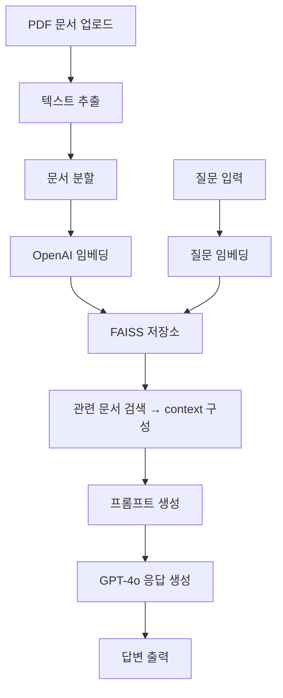

# 2025-04-17 (실습)

# 📘 PDF 문서 기반 RAG QA 시스템 구축 (LangChain + OpenAI)

> 참고: PDF 문서 기반 QA #RAG 구축하기
> 

*LangChain + OpenAI + FAISS + PyMuPDF 조합*

---

## 📦 1. 필요한 모듈 설치

```bash
pip install langchain langchain-core langchain-community langchain-openai langchain-text-splitters faiss-cpu PyMuPDF python-dotenv openai
```

---

## 📂 2. 라이브러리 불러오기

```python
# 파일의 내용을 일정한 chunk 단위로 잘라주는 스플리터
from langchain_text_splitters import RecursiveCharacterTextSplitter
# PDF 파일을 읽어오는 로더 (텍스트 내용 읽음음)
from langchain_community.document_loaders import PyMuPDFLoader
# 임베딩된 벡터 값을 저장하는 벡터 스토어
from langchain_community.vectorstores import FAISS
# LLM의 응답을 단순 문자열로 파싱해주는 클래스
from langchain_core.output_parsers import StrOutputParser
# LangChain 체인 구성 시, 입력을 그대로 다음 단계로 넘겨주는 중간 노드
from langchain_core.runnables import RunnablePassthrough
# 프롬프트에 변수를 바인딩할 수 있게 해주는 템플릿 클래스
from langchain_core.prompts import PromptTemplate
# OpenAI의 GPT-3.5 / GPT-4 모델, 임베딩 모델을 사용하는 LangChain 인터페이스
from langchain_openai import ChatOpenAI, OpenAIEmbeddings

# 단계 0: .env 파일에 저장된 환경변수(OPENAI_API_KEY)를 Python 코드로 불러오는 도구
from dotenv import load_dotenv
load_dotenv() 
```

---

## 📄 3. 문서 로드 (Load PDF)

```python
# 단계 1: 문서 로드(Load Documents)
loader = PyMuPDFLoader("data/SPRI_AI_Brief_2023년12월호_F.pdf")
docs = loader.load()
```

---

## ✂️ 4. 문서 분할 (Chunking)

```python
# 단계 2: 문서 분할(Split Documents)
# chunk size : 문서를 분할하는 단위 -> 하나의 맥락이 끊기는 단위로 설정
# chunk overlap : 분할하는 부분에서 누락되는 내용 없도록 겹치는 범위위
text_splitter = RecursiveCharacterTextSplitter(chunk_size=1000, chunk_overlap=50)
split_documents = text_splitter.split_documents(docs)
```

---

## 🧠 5. 임베딩 생성

```python
# 단계 3: 임베딩(Embedding) 생성
# 여러 가지 임베딩 모델 사용 가능 (LLM 모델과 호환 가능한지 파악 필요) 
embeddings = OpenAIEmbeddings()
```

---

## 🗃️ 6. 벡터 저장소 (FAISS) 생성

```python
# 단계 4: DB 생성(Create DB) 및 저장
# 벡터스토어를 생성합니다. (벡터스토어도 선택 가능능)
vectorstore = FAISS.from_documents(documents=split_documents, embedding=embeddings)
```

---

## 🔍 7. 리트리버 생성

```python
# 단계 5: 검색기(Retriever) 생성
# 문서에 포함되어 있는 정보를 검색하고 생성합니다.
retriever = vectorstore.as_retriever()
```

---

## 💬 8. 프롬프트 템플릿 작성

```python
# 단계 6: 프롬프트 생성(Create Prompt)
# 프롬프트를 생성합니다.
prompt = PromptTemplate.from_template(
    """You are an assistant for question-answering tasks. 
Use the following pieces of retrieved context to answer the question. 
If you don't know the answer, just say that you don't know. 
Answer in Korean.

#Context: 
{context}

#Question:
{question}

#Answer:"""
)
```

---

## 🤖 9. LLM 생성 (GPT-4o 사용)

```python
# 단계 7: 언어모델(LLM) 생성
# 모델(LLM) 을 생성합니다.
llm = ChatOpenAI(model_name="gpt-4o", temperature=0)
```

---

## 🔗 10. 체인 구성

```python
# 단계 8: 체인(Chain) 생성
# 리트리버를 사용해 유사도가 높은 chunk들을 받아와서 context 구성
# 받아온 입력 그대로 question에 사용
# 결과값을 parser를 사용하여 원하는 형태로 파싱
# prompt -> llm -> strOutputParser() 순으로 실행
chain = (
    {"context": retriever, "question": RunnablePassthrough()}
    | prompt
    | llm
    | StrOutputParser()
)
```

---

## ▶️ 11. 질문 → 응답 실행

```python
# 체인 실행(Run Chain)
# 문서에 대한 질의를 입력하고, 답변을 출력합니다.
question = "삼성치 개발한 자체 AI 이름은?"
response = chain.invoke(question)
print(response)
```

---

## ✅ 전체 구조 요약



## 📈 RAG 고도화 체크리스트: 응답 오류 원인 진단

> ✅ 전제: Vector Store에 정답이 되는 정보가 있음에도 LLM이 정확하게 답변하지 못하는 경우
> 

---

### 🔍 1. **Retriever (검색기) 점검**

- **증상**: 엉뚱한 문단이 context로 선택되거나, 핵심 정보가 누락됨
- **가능성**:
    - query embedding이 질문의 핵심을 잘 반영하지 못함
    - similarity metric이 부정확 (예: cosine vs dot product)
    - `k` 값이 너무 작거나 너무 큼
- **점검 포인트**:
    - `retriever.get_relevant_documents()` 결과 직접 출력해보기
    - `k` 값 조정
    - MaxMarginalRelevanceRetriever 등 대체 retriever 실험
    - 질의 임베딩 prefix 사용 (예: `"query: {질문}"` vs `"passage: {문장}"`)

---

### 📄 2. **Loader (문서 로더) 점검**

- **증상**: 특정 문서가 로드되지 않거나, 공백/문자 깨짐
- **가능성**:
    - PDF 내 레이어, 이미지 텍스트 등으로 인해 텍스트 추출 실패
    - 일부 페이지가 누락됨
- **점검 포인트**:
    - `loader.load()` 결과 중 일부 샘플 출력
    - 다른 로더 사용: `PyMuPDFLoader`, `PDFPlumberLoader`, `UnstructuredPDFLoader` 비교

---

### ✂️ 3. **Splitter (문단 분할기) 점검**

- **증상**: 문장이 잘려 맥락이 끊김 or 너무 큰 덩어리로 분할됨
- **가능성**:
    - chunk size / overlap 설정이 문서 구조에 맞지 않음
    - newline 기준 분할보다 semantic 기준 분할이 적절한 경우
- **점검 포인트**:
    - `split_documents(docs)` 결과 직접 확인
    - `RecursiveCharacterTextSplitter` → `RecursiveTextSplitter` 등 교체 실험
    - chunk 크기 줄이고 overlap 늘려보기 (예: 500 / 100)

---

### 🧠 4. **Embedding (벡터화) 점검**

- **증상**: 유사한 문장을 잘 매칭하지 못함
- **가능성**:
    - 사용하는 embedding 모델이 해당 언어/도메인에 최적화되지 않음
    - query vs document embedding의 prefix 설정이 잘못됨
- **점검 포인트**:
    - `text-embedding-3-small` vs `text-embedding-ada-002` 비교
    - HuggingFace 기반 `e5`, `bge` 시리즈와 비교 실험
    - 문서/질문 prefix를 명시적으로 붙여 테스트

---

### 🗃️ 5. **Vector Store (DB) 점검**

- **증상**: 벡터는 생성되었으나 검색 성능이 낮음
- **가능성**:
    - vectorstore의 search method 또는 설정이 부적절
    - 벡터가 올바르게 저장되지 않음
- **점검 포인트**:
    - FAISS vs Chroma vs Pinecone 비교
    - 저장된 벡터 개수 및 ID, 메타데이터 확인
    - `vectorstore.similarity_search()`로 유사도 점검

## ✅ 결론: 단계별 점검 로드맵

- Loader : 문서가 잘 읽히는가?
- Splitter : 잘게 나누는 방식이 적절한가?
- Embedding : 의미가 잘 보존되고 있는가? (벡터값 변환이 적절한가?)
- Vector Storage : 벡터 저장/검색이 정확한가?
- Retriever : 질문에 맞는 정보를 검색하는가?