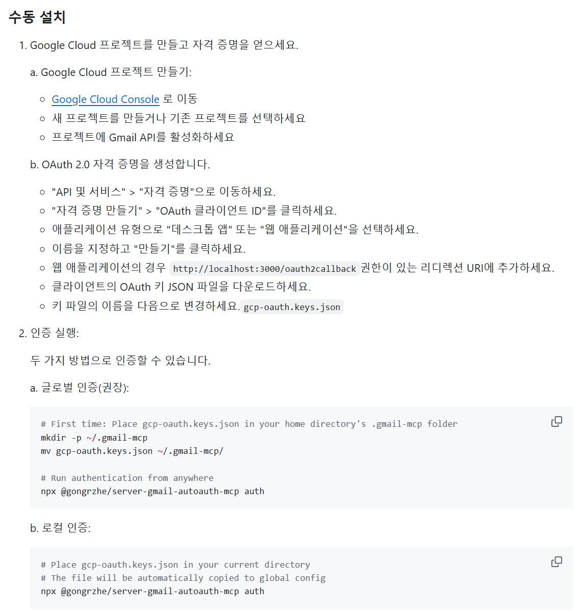

# 2025-04-26 (Gmail MCP)

# Gmail MCP 서버

## Gmail MCP 서버 사용 (Claude Desktop)



### 0. Google OAuth ID 발급

- [https://console.cloud.google.com/apis/credentials](https://console.cloud.google.com/apis/credentials) 접속
- ID 발급 받기
    1. **"사용자 인증 정보"** 탭 가기
    2. **"사용자 인증 정보 만들기"** ➔ **"OAuth 클라이언트 ID"** 선택
    3. **애플리케이션 유형**: "웹 애플리케이션" 선택
    4. 이름: 자유롭게 (예: “gmail-mcp-key")
    5. 승인된 리디렉션 URI에 [http://localhost:3000/oauth2callback](http://localhost:3000/oauth2callback) 추가
    6. **생성** 클릭
    7. 팝업에서 **클라이언트 ID**와 **클라이언트 Secret**을 확인할 수 있음.
    
    ✅ 다운로드 버튼 눌러 JSON 파일 받는다.
    
    ✅ 그 파일을 이름을 `gcp-oauth.keys.json`로 바꾼다.
    
    1. 테스트 유저에 이메일 mcp 서버 사용할 사용자 메일 추가
    2. **gmail api 사용 켜기**
    
    
    
- gcp-oauth.key.json 파일을 사용자 폴더 아래 위치
    - **터미널 현재 폴더 (ex: C:\Users\SSAFY)**
    - **C:\Users\SSAFY.gmail-mcp** (숨은 폴더)

### 1. 관련 MCP 서버 설치

- https://github.com/GongRzhe/Gmail-MCP-Server
- 해당 서버를 설치해주고 권한 받아오는 명령어
    - npx @gongrzhe/server-gmail-autoauth-mcp auth
    
    
    

### 2. 데스크탑에 MCP 서버 추가

```jsx
{
  "mcpServers": {
    "gmail": {
      "command": "npx",
      "args": [
        "@gongrzhe/server-gmail-autoauth-mcp"
      ]
    }
  }
}
```

### 3. 사용

- 이메일 전송


- 이메일 조회


- 이메일 삭제


### 인사이트

1. 우리 앱에 대한 oauth 클라이언트를 하나 생성
2. 여기서 구글 인증 처리를 담당
3. 즉 mcp 서버에서 해당 구글 권한이 필요한 경우 해당 페이지로 리다이렉트 시키고 사용자는 우리 oauth 키를 바탕으로 oauth 동의 화면을 띄움
4. 해당 화면에서 사용자는 로그인 (메일에 대한 권한 승인)
- 그러나 현재 우리 클라이언트는 "테스트 중"이므로 안전하지 않아서 사용자들은 테스트 유저로 등록 필요

따라서,
우리 서비스에 로그인을 할 때 테스트 유저로 등록을 해두고, 사용자의 권한 리디렉션 됐을 때 앱에 접근할 수 있도록 처리 필요