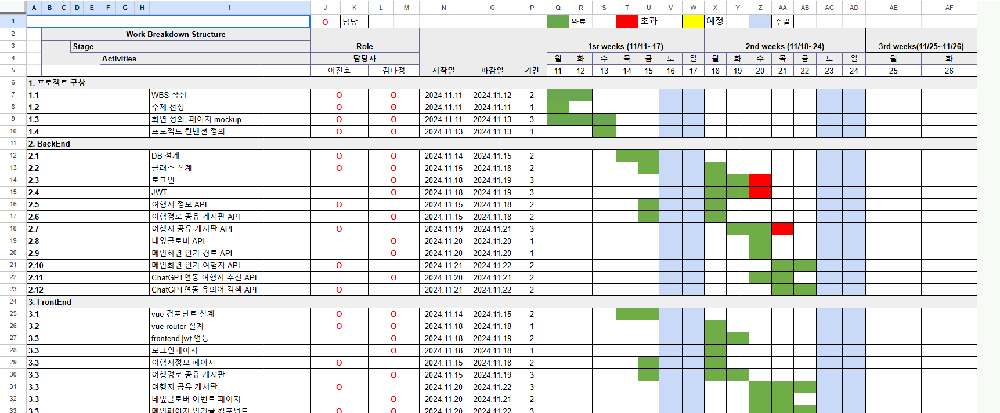

# 과업 리스트업

날짜: 2025년 5월 2일
서기: 다정 김
회의 유형: 기획회의

**[ 일정 관리 ] ( ~ 05월 04일 ) 파란색 : 토요일 / 핑크색 : 일요일**

- [ ]  일정 관리표 작성 (WBS 구글시트)
    - WBS
        
        
        
- [ ]  지라 백로그 스토리 추가
- [ ]  업무 분담

---

**[ 설계 ] ( ~ 05월 04일 )**

- [ ]  요구사항 명세서
- [ ]  기능 명세서
- [ ]  유저 플로우
- [ ]  아키텍처 구조도
- [ ]  API 명세서
- [ ]  ERD
- [ ]  아이디어 내용 정리
- [ ]  기획 배경 및 근거 자료 같은 거 미리 찾아두는 건 어떠할지
    - [ ]  대상(사진 검색을 주로 하는 디자이너/퍼블리셔, 정보성 내용을 캡처 많이 하는 조은 씨)
    - [ ]  통계, 기사
    - [ ]  등

---

**[ UI 디자인 ] ( ~ 05월 04일 )**

- [ ]  Figma 와이어프레임
- [ ]  Figma 디자인 << 이건 아마 월요일 오전?

---

**[ 프론트  : MVP ] ( ~ 05월 08일 )** 

- [ ]  로그인 페이지
- [ ]  채팅(검색) 페이지 (카톡형)(단발성)
- [ ]  사진 보여주는 페이지 (일정 + 즐겨찾기 + 임베딩된 사진들)
- [ ]  마이페이지 또는 환경설정 페이지

---

**[ 백엔드 Java : MVP ] ( ~ 05월 08일 )**

- [ ]  로그인 처리
- [ ]  알림 스케줄링
- [ ]  (추가 업무 고민)

---

**[ RAG Python : MVP ] ( ~ 05월 08일)**

- [ ]  이 이미지가 “예약/일정” 이미지인지 아닌지 판단
- [ ]  검색문장이 이미지에 가까운지 텍스트성에 가까운지 숫자로 변환 (0~1)
- [ ]  (추가 업무 고민)

---

**[ 유저 테스트 ] (~5월 9일) (금)**

- [ ]  갤럭시 유저 대상 apk 배포
- [ ]  구글 설문지 공유
- [ ]  설문지 내용 요약 정리
- [ ]  개선할 기능 선정

---

**[기능 개선] ~ 05월 16일**

- 개선

---

**[ 발표준비 ] (5/12~21)**

- [ ]  동영상
- [ ]  발표 시나리오 구상
- [ ]  시연 시나리오 구상
- [ ]  PPT 제작
- [ ]  자료 조사

---

**[발표] 5/22**

- [ ]  최종발표

- 삭제 가능여부?
    
    
    
    